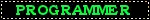

  
  
  

<h1 align="center">
  
  I'm Vratej Dwivedi 👋
</h1>

  

---
<table>
  <tr>
    <td width="60%">
      
### 🚀 About Me
- 🎨 I do Graphic Design, UI/UX, and Web Development  
- 🌱 Currently learning Front-end & Back-end Development  
- 💡 Passionate about creative and functional designs  
- 📌 Open to Internships & Freelance Work  
- 💻 Tech Stack: Python | Java | HTML | CSS | JavaScript  
- 🎨 Design Tools: Figma | Canva | Ibis Paint X  

    </td>
    <td width="40%" align="center">
      
    </td>
  </tr>
</table>

  

---

### ⚡ Tech Stack

  

---

---

### 🌟 GitHub Stats

  
  

---

### 📫 Connect with Me

  
  
  

---

   &nbsp;
   &nbsp;
   &nbsp;
   &nbsp;
  

  🔥 Keep creating. Keep innovating. The future is yours! 🔥

  

